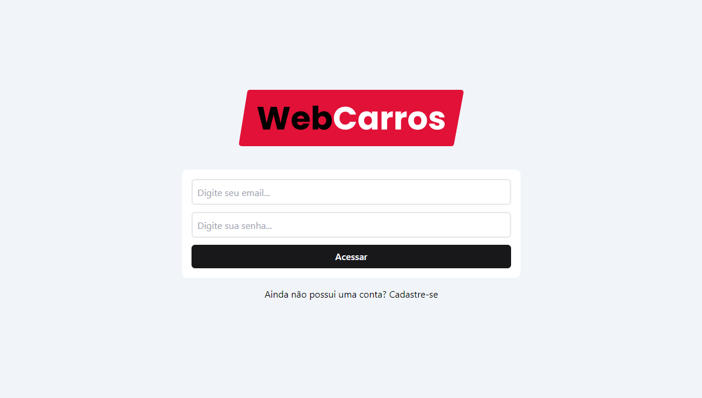
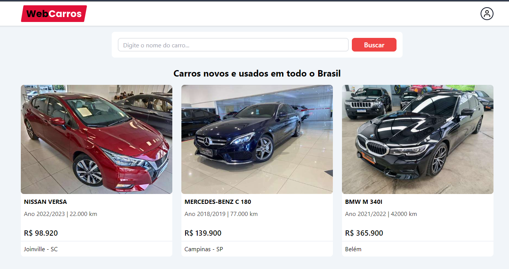
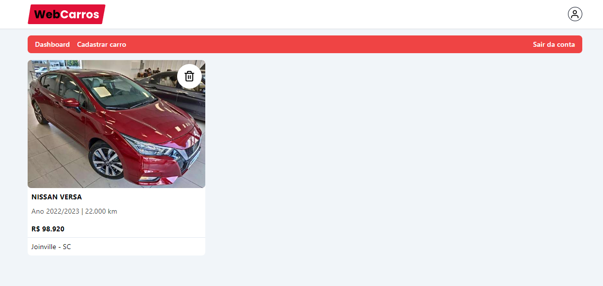
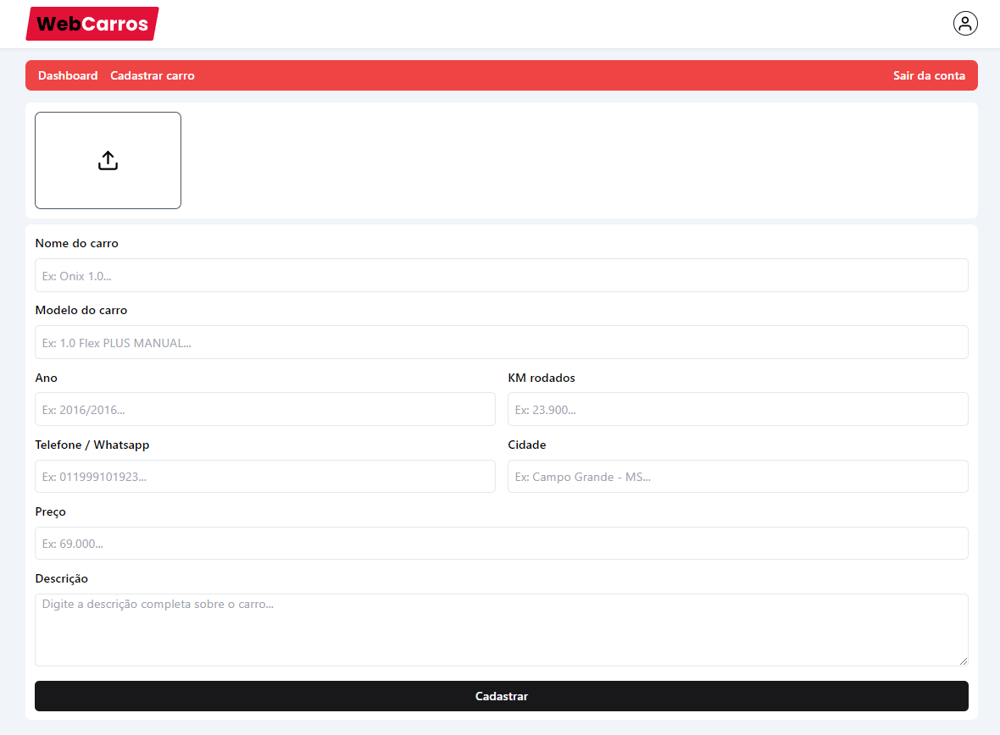

<h1 align="start"> WebCarros </h1>

  

## 💻 Projeto

WebCarros é uma plataforma online de vendas de carros. Com ele, é possível:

- Cadastrar veículos para venda;
- Visualizar anúncios de outros usuários;
- Contatar diretamente o anunciante via WhatsApp para negociações rápidas.

  

  

  

## 🚀 Tecnologias

Este projeto foi desenvolvido com as seguintes tecnologias:

- ReactJs + Vite
- Typescript
- Tailwind CSS
- Firebase
- React Router Dom
- React Hook Form + Zod
- React Hot Toast
- Swiper